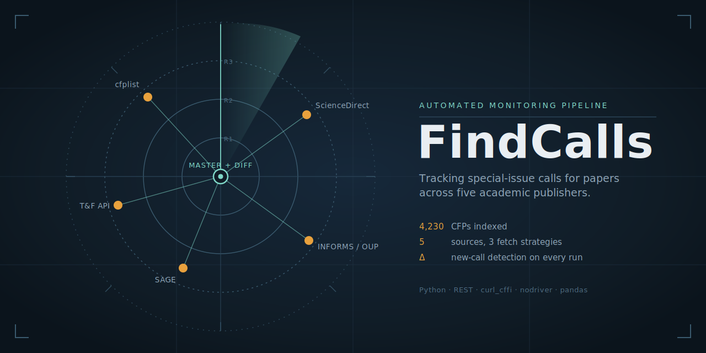

<p align="center">
  
</p>

<h1 align="center">FindCalls</h1>

<p align="center">
  <b>One script that tracks academic calls for papers across six sources — five journal publishers and the NLP conference circuit — merges them into a single sheet, and flags what's new since your last run.</b>
</p>
[](https://doi.org/10.5281/zenodo.21714795)

<p align="center">
  
  
  
  
</p>

---

Academic calls for papers (CFPs) live on publisher portals built on wildly different tech: static HTML, AJAX pagination, WordPress REST APIs, and aggressively bot-protected platforms. Checking them by hand is a weekly chore. **FindCalls** handles all six in a single run — using the lightest technique that actually works for each — normalizes everything into one schema, and answers the only question that matters between runs: *what's new?*

Built by a defense operations-research analyst to stop manually refreshing a dozen journal and conference pages. Initial index: **4,200+ unique CFPs** across **6 sources** — five journal publishers plus NLP conferences.

## Highlights

- **Single entry point.** `findcalls.py` runs every crawler and the merge. No other files needed.
- **Six sources, four fetch strategies** — pure REST, static table parsing, headless Playwright, and a stealth (`nodriver`) browser — each matched to the site's actual defenses.
- **Diff on every run.** A first-seen registry means each run surfaces only newly posted calls, not the whole haystack.
- **Fault-isolated stages.** If one site is down or blocks you, that stage is skipped and the rest still produce output.
- **Relevance tagging.** Two editable regexes score each CFP (`★★` / `★`) against your target journals and topics.

## How it works

```
STAGE            SOURCE                       FETCH STRATEGY
─────────────────────────────────────────────────────────────────────────
tandf            Taylor & Francis             WordPress REST API (no browser)
cfplist          cfplist.com                  Playwright, headless
sciencedirect    ScienceDirect                nodriver (PerimeterX-stealth)
sage             SAGE journals                nodriver (Cloudflare-stealth)
watchlist        INFORMS · OUP · Cambridge    nodriver, template-driven
aclweb           ACL Portal (NLP venues)      requests (static sortable table)
─────────────────────────────────────────────────────────────────────────
master           →  normalize → dedupe (URL key) → relevance-tag → diff
                 →  CFP_master.xlsx   +   cfp_snapshot.json
```

Each source got the **minimum** machinery it required — escalating only when a simpler approach failed:

| Source | Tech encountered | Strategy |
|---|---|---|
| Taylor & Francis | Slow, stateful listing UI | Discovered the underlying **WP REST API** → plain pagination, no browser. Zero missing fields. |
| cfplist.com | AJAX pagination (URL params ignored) | Headless Playwright click-through. |
| ScienceDirect | React SPA, robots-disallowed, **PerimeterX/HUMAN** bot defense | `nodriver` (shared with SAGE) + JS-rendered pagination. PerimeterX silently blocks automated Chromium without even showing a CAPTCHA, so a stealth browser is required — see notes below. |
| SAGE (Atypon) | TLS fingerprinting, headless detection, **Cloudflare Turnstile** | `nodriver` + locale-agnostic challenge detection + multi-variant URL discovery. |
| INFORMS / OUP / Cambridge | Uniform per-journal URL patterns | One config: URL templates + journal codes + auto-discovery fallback. |
| ACL Portal (NLP venues) | Static sortable HTML table, no bot defense | Plain `requests` + table parse. Chosen over the OpenReview API, which is submission-centric and doesn't expose deadlines. |

## Install

```bash
pip install requests curl_cffi nodriver playwright beautifulsoup4 pandas openpyxl
playwright install chromium
```

Requires Python 3.10+ and Google Chrome installed (for the `nodriver` stages).

## Usage

Run everything:

```bash
python findcalls.py
```

**Re-crawl a single source.** Each source has its own flag. This is the common case — a stage timed out, got blocked, or you just want fresh data from one publisher without re-running the others:

```bash
python findcalls.py --sciencedirect          # re-pull ScienceDirect, then re-merge
python findcalls.py --sciencedirect --sage   # re-pull several sources
python findcalls.py --aclweb                  # refresh NLP conference CFPs, then re-merge
```

Re-crawling a source updates only that source's CSV; the other sources' CSVs are left untouched, so the merge always reflects the most recent pull of *every* source. The `master` stage runs automatically after a per-source re-crawl so `CFP_master.xlsx` stays in sync — add `--no-master` to skip that.

**Other selectors:**

```bash
python findcalls.py --master                 # just re-merge existing CSVs, no crawling
python findcalls.py --only tandf,master      # run a specific subset
python findcalls.py --skip sciencedirect,sage  # run everything except these
```

Available stages: `tandf`, `cfplist`, `sciencedirect`, `sage`, `watchlist`, `aclweb`, `master`. Flag priority is per-source flags → `--only` → default (all).

**Both `sciencedirect` and `sage` open a stealth browser window** (they share one `nodriver` session) and may need a moment of help if a challenge appears — click it in the window; manual clicks work under `nodriver`. ScienceDirect waits for the list to render and paginates on its own, so no manual Enter is needed.

If ScienceDirect collects nothing (blocked or the list didn't render), the previous good CSV is **kept, not overwritten** — just re-run that one source with `python findcalls.py --sciencedirect`.

For an unattended run, use `--skip sciencedirect,sage`.

The console reports per-source counts and the number of **new CFPs since the last run**. Results land in `CFP_master.xlsx`:

| Sheet | Contents |
|---|---|
| `New` | CFPs first seen in this run, relevance-sorted |
| `Active & relevant` | Open calls matching your target-journal / topic rules |
| `All` | Full deduplicated index with status (open / closed / unknown) |

### Files it writes

| File | Role | Safe to delete? |
|---|---|---|
| `CFP_master.xlsx` | The output workbook (three sheets) | Yes — regenerated every run |
| `*_cfps.csv` / `cfplist_all.csv` | Per-source intermediate data | Yes, but that source drops out of the merge until you re-crawl it |
| `cfp_snapshot.json` | First-seen registry powering the `New` diff | **No** — deleting it makes the next run flag *everything* as new |

### Resilience

The pipeline is built so a single flaky source can't sink a run:

- **Stages are isolated.** If a crawler stage throws, it's logged and skipped; the remaining stages still run and `master` merges whatever sources succeeded.
- **Empty or corrupt CSVs are tolerated.** The merge reads each source defensively — a missing, zero-byte, header-only, or unparseable CSV is skipped with a warning instead of crashing the merge.
- **A failed crawl won't clobber good data.** If ScienceDirect collects nothing (e.g. the page didn't load in time), it preserves the existing CSV rather than overwriting it with an empty file — so your last good pull survives and one `--sciencedirect` re-run restores the full index.
- **Blank pages self-diagnose.** If a paginated stage's first page yields zero items, it prints a live DOM report (link counts, sample hrefs) and dumps the raw HTML to `debug_html/`, so a selector fix is driven by evidence rather than guesswork.

### Cleaning up

```bash
python findcalls.py --delete       # remove CSVs, CFP_master.xlsx, debug_html/ — keeps the snapshot
python findcalls.py --delete-all   # also removes cfp_snapshot.json (resets the diff history)
python findcalls.py --delete --yes # skip the confirmation prompt
```

`--delete` clears the crawl outputs but **keeps `cfp_snapshot.json`**, so your first-seen history stays intact. Use `--delete-all` only when you want a clean slate — the next run will then flag every CFP as new. Both prompt for confirmation unless you pass `--yes`.

## Configuration

Everything you'd want to tune lives near the top of the relevant section in `findcalls.py`:

- **Relevance rules** — `TARGET_JOURNALS` and `TOPIC_KEYWORDS` regexes. Matching both → `★★`, either → `★`. Defaults target operations research, defense & security studies, technology policy, and NLP/LLM research.
- **Journal watchlists** — `SAGE_WATCHLIST` and `PUB_WATCHLIST` lists (publisher, name, journal code). Add or remove journals here.

## Anti-bot engineering notes

Two of the six sources sit behind commercial bot managers, and each needed a different escalation. These are the most instructive parts of the project.

### SAGE — Cloudflare Turnstile (seven iterations)

A compact tour of modern bot defense:

1. **`requests` + spoofed User-Agent → 403.** The platform fingerprints the TLS handshake; headers are irrelevant.
2. **Headless Chromium → 403.** The `HeadlessChrome` UA token and `navigator.webdriver` flag give it away.
3. **Headed Chromium → Cloudflare Turnstile loops forever**, even with a human clicking — Turnstile detects the CDP connection Playwright relies on.
4. **`nodriver` passes** — but challenge pages are served **in the visitor's locale**, so detection keyed on English strings silently accepted a Korean challenge page as real content. Fix: detect via the `<title>` tag across locales plus challenge-only variables — and *not* via `/cdn-cgi/challenge-platform`, which Cloudflare injects into legitimate pages too.
5. Final touches: ordinal date parsing ("30th September, 2026"), plural-aware link discovery ("Call**s** for Papers"), and scoping deadline extraction to each entry's nearest container so one section's date doesn't bleed onto every item.

### ScienceDirect — PerimeterX, then three parsing traps

ScienceDirect was originally scraped with headed Playwright, but it kept collecting **zero** items. The fix took three distinct steps — each a reminder that "the browser opened" is not "the scrape worked":

1. **PerimeterX/HUMAN, not Cloudflare.** Elsevier fingerprints automated Chromium and *silently* blocks it — no CAPTCHA checkbox ever appears, so there's nothing for a human to solve; the list simply never renders. Reusing the `nodriver` stealth browser already built for SAGE got past it. (The two stages now share one session.)
2. **Text-matched "Next" clicked the wrong link.** Finding the pagination button by its visible text (`find("Next")`) matched a **journal named "Next Energy"** in the results and navigated off the listing — back to zero. Fixed by targeting the control via attribute selectors only (`a[aria-label*='next'], a[rel='next']`), never by text, plus an off-page guard that detects navigation away from the list path and recovers.
3. **`evaluate()` return shapes broke parsing.** `nodriver`'s `tab.evaluate` returns JS results in different shapes across versions (a `dict` vs. a `[value, type]` list), which raised `'list' object has no attribute 'get'`. Fixed by having the injected JS return a **`JSON.stringify(...)` string** and parsing it with `json.loads` on the Python side — version-independent — plus `isinstance` guards so a malformed return degrades gracefully instead of crashing.

Result: a stable ~2,700-item pull, and a `_diagnose()` helper that prints DOM link counts and sample hrefs (and dumps the page HTML) whenever a first page comes back empty — so the next selector break is a five-minute fix, not a mystery.

## Responsible use

- Built for **personal research monitoring**: low volume, 1.5–3 s delays, no parallelism, public CFP pages only — nothing behind a paywall.
- Some sites disallow automated access in `robots.txt` or their terms. Review each site's terms and your local regulations before running the corresponding stage, and prefer official channels (e-mail alerts, RSS, publisher APIs) where they exist.
- Don't redistribute collected listings; deadlines change and stale mirrors mislead authors.

## Known limitations

- Some publishers' central listing pages are manually curated and incomplete; per-journal watchlists compensate.
- Top venues (e.g. *JCR*, *JPR*, *ISQ*, *International Affairs*) run **no open CFPs** by policy — special issues are assembled via guest-editor proposals, so a crawler correctly returns nothing there. Reach these through regular submission, or by proposing a themed issue yourself.
- Commercial bot managers and site markup change over time; expect occasional selector or challenge-detection maintenance. Paginated stages self-diagnose on empty pages and dump raw HTML to `debug_html/`, so fixes are evidence-driven.
- NLP conferences increasingly run on **ACL Rolling Review** (submit to ARR, then commit to a venue), so the `aclweb` stage captures posted CFP deadlines rather than the full two-step ARR cycle. For live ARR-round countdowns, the community site [aideadlin.es](https://aideadlin.es/?sub=NLP) with its `.ics` export is a good complement.

## Roadmap

- Springer / Wiley journal-ID watchlists (templates already wired in)
- Scheduled runs + e-mail/Slack digest of the `New` sheet
- Per-paper matching: rank open calls against a manuscript abstract

## License

MIT — crawl responsibly.
